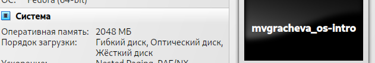

---
## Front matter
title: "Отчёт по лабораторной работе №1"
author: "Грачева Мария Валерьевна"

## Generic otions
lang: ru-RU
toc-title: "Содержание"

## Bibliography
bibliography: bib/cite.bib
csl: pandoc/csl/gost-r-7-0-5-2008-numeric.csl

## Pdf output format
toc: true # Table of contents
toc-depth: 2
lof: true # List of figures
lot: true # List of tables
fontsize: 12pt
linestretch: 1.5
papersize: a4
documentclass: scrreprt
## I18n polyglossia
polyglossia-lang:
  name: russian
  options:
	- spelling=modern
	- babelshorthands=true
polyglossia-otherlangs:
  name: english
## I18n babel
babel-lang: russian
babel-otherlangs: english
## Fonts
mainfont: PT Serif
romanfont: PT Serif
sansfont: PT Sans
monofont: PT Mono
mainfontoptions: Ligatures=TeX
romanfontoptions: Ligatures=TeX
sansfontoptions: Ligatures=TeX,Scale=MatchLowercase
monofontoptions: Scale=MatchLowercase,Scale=0.9
## Biblatex
biblatex: true
biblio-style: "gost-numeric"
biblatexoptions:
  - parentracker=true
  - backend=biber
  - hyperref=auto
  - language=auto
  - autolang=other*
  - citestyle=gost-numeric
## Pandoc-crossref LaTeX customization
figureTitle: "Рис."
tableTitle: "Таблица"
listingTitle: "Листинг"
lofTitle: "Список иллюстраций"
lotTitle: "Список таблиц"
lolTitle: "Листинги"
## Misc options
indent: true
header-includes:
  - \usepackage{indentfirst}
  - \usepackage{float} # keep figures where there are in the text
  - \floatplacement{figure}{H} # keep figures where there are in the text
---

# Цель работы

Целью данной работы является приобретение практических навыков установки операционной системы на виртуальную машину, настройки минимально необходимых для дальнейшей работы сервисов.

# Выполнение лабораторной работы

 
 Перехожу в каталог /var/tmp и создаю каталог с моим именем 
 (рис. @fig:001).

{#fig:001 width=70%}
  
 Задаю отображение информации о настройках VirtualBox на английском(рис. @fig:002).

{#fig:002 width=70%}

Установливаю папку для виртуальных машине в /var/tmp/имя_пользователя(рис. @fig:003).

{#fig:003 width=70%}
Поверяю, что папка виртуальных машин по умолчанию изменена: (рис. @fig:004).

{#fig:004 width=70%}

Следующая команда выдаст только каталог:(рис. @fig:005).

{#fig:005 width=70%}

Переношу установочный образ в папку /var/tmp/имя_пользователя/iso:(рис. @fig:006).(рис. @fig:007).

{#fig:006 width=70%}

{#fig:007 width=70%}

Настройка хост-клавиши

Проверяю текущую комбинацию для хост-клавиши:(рис. @fig:008).

{#fig:008 width=70%}

Установливаю нужную клавишу (в примере клавиша Menu):(рис. @fig:009).

{#fig:009 width=70%}

Создание виртуальной машины

Для использования графического интерфейса запускаю менеджер виртуальных машин, введя в командной строке:(рис. @fig:010). (рис. @fig:011).

{#fig:010 width=70%}

{#fig:011 width=70%}

Создаю новую виртуальную машину в графическом интерфейсе или в командной строке. (рис. @fig:012), (рис. @fig:013).

{#fig:012 width=70%}

{#fig:013 width=70%}

Указываю имя виртуальной машины (ваш логин в дисплейном классе), тип операционной системы — Linux, Fedora.

Указываю размер основной памяти виртуальной машины — от 2048 МБ.(рис. @fig:014).(рис. @fig:015).

{#fig:001 width=70%}

{#fig:001 width=70%}

Задаю конфигурацию жёсткого диска — загрузочный, VDI (VirtualBox Disk Image), динамический виртуальный диск.

Задаю размер диска — 80 ГБ (или больше), его расположение — в данном случае /var/tmp/имя_пользователя/имя_машины/имя_машины.vdi.(рис. @fig:016).

{#fig:016 width=70%}
Выбираю в VirtualBox Вашей виртуальной машины. Добавляю новый привод оптических дисков и выбираю образ.

Подключаю загрузку с DVD:(рис. @fig:017).

{#fig:017 width=70%}

 Добавляю IDE-контроллер:(рис. @fig:018).

{#fig:018 width=70%}

Устанавливаю созданный мной файл VDI в качестве первого виртуального жесткого диска новой виртуальной машины:(рис. @fig:019).

{#fig:019 width=70%}

Подключаю к виртуальной машине ISO-файл:(рис. @fig:020).

{#fig:020 width=70%}

В качестве графического контроллера ставлю VMSVGA.(рис. @fig:021).

{#fig:021 width=70%}

Включаю ускорение 3D. (рис. @fig:022).

{#fig:022 width=70%}

Включаю общий буфер обмена и перетаскивание объектов между хостом и гостевой ОС.(рис. @fig:023).

{#fig:023 width=70%}

Включаю поддержку UEFI.(рис. @fig:024).

{#fig:024 width=70%}

# Выводы

Я приобрела практические навыки установки операционной системы на виртуальную машину, настройки минимально необходимых для дальнейшей работы сервисов.

# Список литературы{.unnumbered}

::: {#refs}
:::
