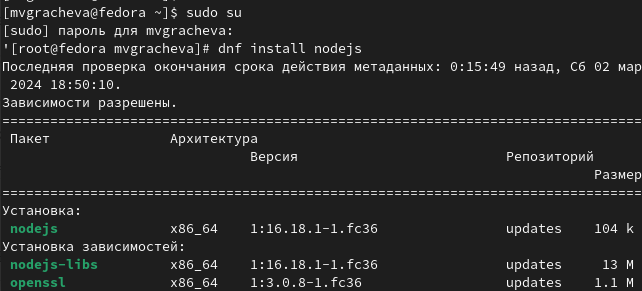
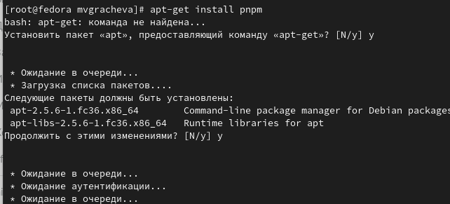

---
## Front matter
title: "Отчёт по лабораторной работе №4"
subtitle: "Продвинутое использование git"
author: "Грачева Мария Валерьевна"

## Generic otions
lang: ru-RU
toc-title: "Содержание"

## Bibliography
bibliography: bib/cite.bib
csl: pandoc/csl/gost-r-7-0-5-2008-numeric.csl

## Pdf output format
toc: true # Table of contents
toc-depth: 2
lof: true # List of figures
lot: true # List of tables
fontsize: 12pt
linestretch: 1.5
papersize: a4
documentclass: scrreprt
## I18n polyglossia
polyglossia-lang:
  name: russian
  options:
	- spelling=modern
	- babelshorthands=true
polyglossia-otherlangs:
  name: english
## I18n babel
babel-lang: russian
babel-otherlangs: english
## Fonts
mainfont: PT Serif
romanfont: PT Serif
sansfont: PT Sans
monofont: PT Mono
mainfontoptions: Ligatures=TeX
romanfontoptions: Ligatures=TeX
sansfontoptions: Ligatures=TeX,Scale=MatchLowercase
monofontoptions: Scale=MatchLowercase,Scale=0.9
## Biblatex
biblatex: true
biblio-style: "gost-numeric"
biblatexoptions:
  - parentracker=true
  - backend=biber
  - hyperref=auto
  - language=auto
  - autolang=other*
  - citestyle=gost-numeric
## Pandoc-crossref LaTeX customization
figureTitle: "Рис."
tableTitle: "Таблица"
listingTitle: "Листинг"
lofTitle: "Список иллюстраций"
lotTitle: "Список таблиц"
lolTitle: "Листинги"
## Misc options
indent: true
header-includes:
  - \usepackage{indentfirst}
  - \usepackage{float} # keep figures where there are in the text
  - \floatplacement{figure}{H} # keep figures where there are in the text
---

# Цель работы

Получение навыков правильной работы с репозиториями git.

# Теоретическое введение

Рабочий процесс Gitflow
Рабочий процесс Gitflow Workflow. Будем описывать его с использованием пакета git-flow.

Общая информация
 Gitflow Workflow опубликована и популяризована Винсентом Дриссеном.
 Gitflow Workflow предполагает выстраивание строгой модели ветвления с учётом выпуска проекта.
 Данная модель отлично подходит для организации рабочего процесса на основе релизов.
 Работа по модели Gitflow включает создание отдельной ветки для исправлений ошибок в рабочей среде.
 Последовательность действий при работе по модели Gitflow:
 Из ветки master создаётся ветка develop.
 Из ветки develop создаётся ветка release.
 Из ветки develop создаются ветки feature.
 Когда работа над веткой feature завершена, она сливается с веткой develop.
 Когда работа над веткой релиза release завершена, она сливается в ветки develop и master.
 Если в master обнаружена проблема, из master создаётся ветка hotfix.
 Когда работа над веткой исправления hotfix завершена, она сливается в ветки develop и master.

# Выполнение лабораторной работы

Установка Node.js
На Node.js базируется программное обеспечение для семантического версионирования и общепринятых коммитов.

Fedora

dnf install nodejs
apt-get install pnpm

Настройка Node.js
Для работы с Node.js добавим каталог с исполняемыми файлами, устанавливаемыми yarn, в переменную PATH.

Запустите:

pnpm setup
Перелогиньтесь, или выполните:

source ~/.bashrc

Общепринятые коммиты
commitizen

Данная программа используется для помощи в форматировании коммитов.

pnpm add -g commitizen
При этом устанавливается скрипт git-cz, который мы и будем использовать для коммитов.
standard-changelog

Данная программа используется для помощи в создании логов.

pnpm add -g standard-changelog
Практический сценарий использования git

Создание репозитория git

Подключение репозитория к github

Создайте репозиторий на GitHub. Для примера назовём его git-extended.

Делаем первый коммит и выкладываем на github:

git commit -m "first commit"
git remote add origin git@github.com:<username>/git-extended.git
git push -u origin master
Конфигурация общепринятых коммитов

Конфигурация для пакетов Node.js

pnpm init
Необходимо заполнить несколько параметров пакета.

Название пакета.
Лицензия пакета. Список лицензий для npm: https://spdx.org/licenses/. Предлагается выбирать лицензию CC-BY-4.0.
Сконфигурим формат коммитов. Для этого добавим в файл package.json команду для формирования коммитов:

"config": {
    "commitizen": {
        "path": "cz-conventional-changelog"
    }
}
Таким образом, файл package.json приобретает вид:

{
    "name": "git-extended",
    "version": "1.0.0",
    "description": "Git repo for educational purposes",
    "main": "index.js",
    "repository": "git@github.com:username/git-extended.git",
    "author": "Name Surname <username@gmail.com>",
    "license": "CC-BY-4.0",
    "config": {
        "commitizen": {
            "path": "cz-conventional-changelog"
        }
    }    
}
Добавим новые файлы:

git add .
Выполним коммит:

git cz
Отправим на github:

git push
Конфигурация git-flow

Инициализируем git-flow

git flow init
Префикс для ярлыков установим в v.

Проверьте, что Вы на ветке develop:

git branch
Загрузите весь репозиторий в хранилище:

git push --all
Установите внешнюю ветку как вышестоящую для этой ветки:

git branch --set-upstream-to=origin/develop develop
Создадим релиз с версией 1.0.0

git flow release start 1.0.0
Создадим журнал изменений

standard-changelog --first-release
Добавим журнал изменений в индекс

git add CHANGELOG.md
git commit -am 'chore(site): add changelog'
Зальём релизную ветку в основную ветку

git flow release finish 1.0.0
Отправим данные на github

git push --all
git push --tags
Создадим релиз на github. Для этого будем использовать утилиты работы с github:

gh release create v1.0.0 -F CHANGELOG.md
Работа с репозиторием git

Разработка новой функциональности

Создадим ветку для новой функциональности:

git flow feature start feature_branch
Далее, продолжаем работу c git как обычно.
По окончании разработки новой функциональности следующим шагом следует объединить ветку feature_branch c develop:

git flow feature finish feature_branch
Создание релиза git-flow

Создадим релиз с версией 1.2.3:

git flow release start 1.2.3
Обновите номер версии в файле package.json. Установите её в 1.2.3.
Создадим журнал изменений

standard-changelog
Добавим журнал изменений в индекс

git add CHANGELOG.md
git commit -am 'chore(site): update changelog'
Зальём релизную ветку в основную ветку

git flow release finish 1.2.3
Отправим данные на github

git push --all
git push --tags
Создадим релиз на github с комментарием из журнала изменений:

gh release create v1.2.3 -F CHANGELOG.md 
Описываются проведённые действия, в качестве иллюстрации даётся ссылка на иллюстрацию (рис. [-@fig:001]).

{#fig:001 width=70%}

(рис. @fig:002).

{#fig:002 width=70%}

(рис. @fig:003).

{#fig:003 width=70%}

# Выводы

Получила навыки правильной работы с репозиториями git.

# Список литературы{.unnumbered}

::: {#refs}
:::
